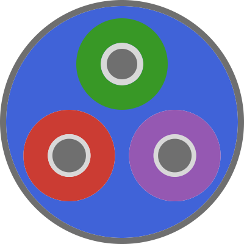

# LineCableModels.jl



[](https://github.com/Electa-Git/LineCableModels.jl/actions/workflows/CI.yml?query=branch%3Amain)

`LineCableModels.jl` is a Julia package for computing the electrical parameters of arbitrary arrangements of underground and overhead power cables, with built-in uncertainty quantification. It is designed as a general-purpose and scalable toolbox to calculate transmission line parameters and to construct models for steady-state analysis and electromagnetic transient (EMT) simulations. 
  
<br>

## Main features

- Uses `Measurements.jl` to model uncertainties in cable geometry, materials, and earth properties.
- Calculates internal DC and AC parameters (R, L, C, G) for solid, tubular, and stranded conductors, including correction factors for temperature, twisting, and stranding effects.
- Detailed representation of cable components, including semiconductors, screens, armoring, insulators, tapes, and water-blocking materials.
- Internal calculation of line impedances/admittances, or direct export to PSCAD Line Constants Program.
- **(in progress)** Computes internal impedances of solid, tubular or coaxial multi-layered single-core (SC) cables, using rigorous ([10.1109/TPAS.1980.319718](https://ieeexplore.ieee.org/document/4113884)) or equivalent approximate formulas available in [industry-standard EMT software](https://www.pscad.com/webhelp/EMTDC/Transmission_Lines/Deriving_System_Y_and_Z_Matrices.htm).
- **(in progress)** Computes earth-return impedances and admittances of underground conductors in homogeneous soil, based on a rigorous solution of Helmholtz equation on the electric Hertzian vector, valid up to 10 MHz ([10.1109/TPWRD.2009.2034797](https://ieeexplore.ieee.org/abstract/document/5437464)). The expressions simplify to Pollaczek's solution if earth permittivity is set to zero.
- **(in progress)** Supports frequency-dependent soil properties.
- **(in progress)** Supports systems comprised by any number of phases with any number of conductors per phase, with or without Kron reduction.
- **(in progress)** Computes phase-domain Z/Y matrices for poliphase systems, and sequence-domain components for three-phase systems, with uncertainty propagation.
- **(in progress)** Includes a novel formulation for cables composed of N concentrical layers, allowing for accurate representations of semiconductor materials.
- General-purpose, reusable and customizable to different use cases via well-structured functions, object-oriented data model and user-defined parameters.

## Formulation

An overview of the methods implemented in `LineCableModels.jl` is given in the document titled [Cable modeling for assessment of uncertainties](https://www.overleaf.com/read/xhmvbjgdqjxn#5e6f69).

## Usage

Clone the package and add to the Julia environment:

```julia
] add https://github.com/Electa-Git/LineCableModels.jl.git
```

```julia
using LineCableModels
```

While the package documentation is a work in progress, a self-contained example is provided in the [`Main.jl`](Main.jl) file. This code demonstrates how to create a cable object, and compute its electrical parameters. The example also shows how to export the cable design to a PSCAD-compatible format.

## License

The source code is provided under the [BSD 3-Clause License](LICENSE).

## Acknowledgements

This work is supported by the Etch Competence Hub of EnergyVille, financed by the Flemish Government. The primary developer is Amauri Martins ([@amaurigmartins](https://github.com/amaurigmartins)).

<p align="center">
  &nbsp;&nbsp;&nbsp;&nbsp;&nbsp;&nbsp;&nbsp;&nbsp;&nbsp;&nbsp;
  &nbsp;&nbsp;&nbsp;&nbsp;&nbsp;&nbsp;&nbsp;&nbsp;&nbsp;&nbsp;
  
</p>

